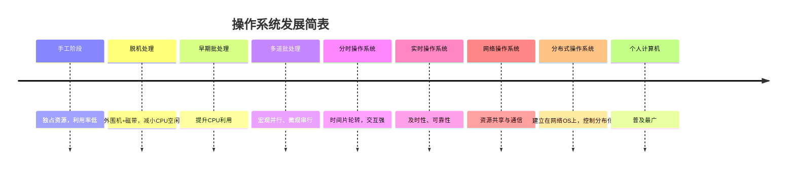

---
# --- 基础设置  ---
title: "408|操作系统笔记：第一章 操作系统概述"
date: 2025-12-30T12:00:00+08:00
author: "Twojian"
draft: false

# --- 封面图设置  ---
cover:
    image: "" # 图片文件名（确保图片就在同一个文件夹下）
    alt: ""        # 辅助文字
    caption: ""      # 图片下方的说明
    relative: false              # 重要：设为 true 才会从当前文件夹查找图片
# --- 分类与标签 ---
categories:
    - "技术"
tags:
    - "操作系统"
    - ""
# --- SEO 与显示控制 ---
description: "操作系统核心概念和发展" # 摘要/描述
showToc: false                   # 是否显示目录
TocOpen: false                  # 目录是否默认开启
hidemeta: false                 # 是否隐藏作者、日期等元数据
---
# 第一章操作系统概述

## 第一章 操作系统概述

**【考频统计】**

| 年份 | 考点 | 分值 |
| --- | --- | --- |
| 2009 | 并发与并行（批处理系统） | 2分 |
| 2010 | 系统调用 | 2分 |
| 2011 | 操作系统运行机制（用户态、内核态） | 2分 |
| 2012 | 操作系统运行机制（用户态、内核态） | 2分 |
| 2013 | 操作系统运行机制（用户态、内核态）、操作系统引导、系统调用 | 23 = 6分 |
| 2014 | 操作系统运行机制（用户态、内核态） | 2分 |
| 2015 | 操作系统运行机制（用户态、内核态） | 2分 |
| 2016 | 批处理系统 | 2分 |
| 2017 | 系统调用、批处理系统 | 22=4分 |
| 2018 | 批处理系统 | 2分 |
| 2019 | 系统调用 | 2分 |
| 2020 |  |  |
| 2021 | 操作系统运行机制（用户态、内核态）、系统调用 | 22=4分 |
| 2022 | 批处理系统、操作系统引导(初始化)、操作系统运行机制（用户态、内核态）、系统调用 | 42=8分 |
| 2023 | 宏内核与微内核、操作系统运行机制（用户态、内核态） | 22=4分 |

> 【考点分析】：注意到用户态与内核态这个知识点考察了8次、系统调用考察了6次、批处理系统（多道程序设计）考察了5次，这几个知识点必须弄得十分清楚！！！此外，异常与中断这个知识点也超级重要，另见单独章节！！！
> 
> 
> 【系统调用的完整过程必须要弄清楚】：大题隐藏考点
> 

## 1.1 操作系统的基本概念

### 1.1.1 操作系统的概念

操作系统（`Operating System，OS`）是指控制和管理整个计算机系统的**硬件和软件**资源(是系统资源的管理者)，并合理地组织调度计算机的工作和资源的分配；以**提供给用户和其他软件方便的接口和环境**(向上层提供方便易用的服务)；它是计算机系统中最基本的**系统软件**（最接近硬件的一层软件）。

### 1.1.2 操作系统的特征

**1. 并发(Concurrence)**

- 指两个或多个事件在**同一时间间隔内**发生(**引入进程**的目的就是使程序可以并发执行)
- 这些事件**宏观上是同时发生的，但微观上是交替发生的**(通过分时实现)

常考易混概念——并行：指两个或多个事件在**同一时刻**同时发生。

操作系统就是伴随着"多道程序技术"而出现的。因此，操作系统和程序并发是一起诞生的。

> 【注】：并行性是指系统具有同时进行运算或操作的特性，在同一时刻能完成多种工作。并行性需要有相关硬件的支持，如多流水线或多处理机硬件环境。
> 

**2. 共享(Sharing)**

即资源共享，是指系统中的资源可供内存中多个并发执行的进程共同使用。

共享方式：

- 互斥共享方式：系统中的某些资源，虽然可以提供多个进程使用，但**一个时间段内只允许一个进程**访问该资源。

> 适用于打印机、磁带机等大多数物理设备，某些软件中使用的栈、变量和表格等临界资源
> 
- 同时共享(访问)方式：系统中的某些资源，允许**一个时间段内由多个进程"同时"对它们进行访问**，所谓的"同时"往往是宏观上的，而在微观上，这些进程可能是交替地对该资源进行访问的（即分时共享）

> 适用于磁盘设备、用重入码编写的文件等资源
> 

**如何判断是互斥还是同时访问：**如果若干进行交替使用设备对结果没有影响，则需同时访问方式(如磁盘)，如果会产生影响，则要互斥访问(如打印机等)；

生活实例：

- 互斥共享方式：使用QQ和微信视频。同一时间段内摄像头只能分配给其中一个进程。
- 同时共享方式：使用QQ发送文件A，同时使用微信发送文件B。宏观上看，两边都在同时读取并发送文件，说明两个进程都在访问硬盘资源，从中读取数据。微观上看，两个进程是交替着访问硬盘的

> 并发性指计算机系统中同时存在着多个运行着的程序。**共享性**是指系统中的资源可供内存中多个并发执行的进程共同使用。
**并发和共享的关系：二者是操作系统最基本的特征，互为存在的条件：**
①资源共享是以程序的并发为条件的，若系统不允许程序并发执行，则自然不存在资源共享问题；
②若系统不能对资源贡献实施有效的管理，则必将影响到程序的并发执行，甚至根本无法并发执行。
> 

**3. 虚拟(Virtual)**

虚拟是指把**一个**物理上的实体变为**若干个**逻辑上的对应物。物理实体（前者）是实际存在的，而逻辑上对应物（后者）是用户感受到的。

> 虚拟处理器：通过多道程序设计技术，让其并发执行来分时使用一个处理器；(时分复用技术，微观上处理机在各个微小的时间段内交替着为各个进程服务)
虚拟存储器：利用覆盖、交换、请求分页/分段/段页等技术逻辑上扩充存储器的容量；(空分复用技术)
虚拟设备：`SPOOLing`技术将一台物理I/O设备虚拟为多台逻辑上的I/O设备。
> 

显然，如果失去了并发性，则一个时间段内系统中只需运行一道程序，那么就失去了实现虚拟性的意义了。因此，没有并发性，就谈不上虚拟性

**4. 异步(Asynchronism)**

在多道程序环境下，允许多个程序并发执行，由于并发运行的程序会争抢着使用系统资源，而系统中的资源有限，因此进程的执行不是一贯到底的，而是走走停停，**以不可预知的速度向前推进**，这就是进程的异步性。

> 如果失去了并发性，即系统只能串行地运行各个程序，那么每个程序的执行会一贯到底。只有系统拥有并发性，才有可能导致异步性。
> 

---

### 1.1.3 操作系统的功能和目标

1. **作为系统资源的管理者**(对应着后面四章)
    - **处理机管理**：即分配和控制处理机，主要包括了进程控制、进程同步、进程通信、调度等
    - **存储器管理**：主要有内存分配、内存保护、地址映射、虚拟存储等
    - **设备管理**：包括缓冲管理、设备分配、设备驱动等
    - **文件管理**：包括文件存储空间的管理、目录管理、文件的读/写管理和保护等

1. **作为用户与计算机硬件系统之间的接口**

封装思想：操作系统把一些丑陋的硬件功能封装成简单易用的服务，使用户能更方便地使用计算机，用户无需关心底层硬件的原理，只需要对操作系统发出命令即可。


- **命令接口**：用户利用这些操作命令来组织和控制作业的执行；
    - **联机命令接口**：即交互式命令接口，适用于分时或实时系统 ；说一句干一句；
        
        
        
    - **脱机命令接口**：批处理命令接口，适用于批处理系统，由一组控制命令组成 ；提供一个事情清单，一条一条完成；
- **程序接口：**由一组**系统调用**(也称广义指令)组成。用户通过在程序中使用这些系统调用来请求操作系统为其提供服务，如使用各种外部设备、申请分配和回收内存及其他要求；例如图形用户接口GUI。


1. **实现对计算机资源的抽象(扩充)**：
    
    <aside>
    💡
    
    没有任何软件支持的计算机称为裸机，它仅构成计算机系统的物质基础，而实际呈现在用户面前的计算机系统是经过若干层软件改造的计算机。裸机在最里层，其外面是操作系统。操作系统所提供的资源管理功能和方便用户的各种服务功能，将裸机改造成功能更强、使用更方便的机器：因此，我们通常把覆盖了软件的机器称为扩充机器或虚拟机。
    
    </aside>
    

---

## 1.2 操作系统发展历程


### 1.2.1 手工操作阶段


缺点：用户独占全机，资源利用率极低；CPU等待手工操作，利用不充分

### 1.2.2 批处理阶段

引入**脱机输入/输出技术**（用外围机+磁带完成），并由监督程序负责控制作业的输入、输出

1. **单道批处理系统**：系统对作业的处理是成批进行的，但内存中**始终保持一道作业；**是在解决人机矛盾及CPU和I/O设备速率不匹配的矛盾中形成的；
    
    
    
- **特点**：
    - 自动性：磁带上的一批作业自动逐个运行，而无须人工干预，缓解了一定程度的人机速度矛盾，资源利用率有所提升。
    - 顺序性：各道作业**顺序进入内存，顺序完成；**
    - 单道性：内存中**仅能有一道程序运行**，只有该程序运行结束之后才能调入下一道程序。CPU有大量的时间是在空闲等待I/O完成，资源利用率依然很低。
1. **多道批处理系统**：每次往内存中读入多道程序，作业成批运行
    
    
    
- **主要优点**：多道程序并发执行，共享计算机资源。资源利用率大幅提升，CPU和其他资源更能保持"忙碌"状态，系统吞吐量增大
- **主要缺点**：**用户响应时间长**，**没有人机交互功能**（用户提交自己的作业之后就只能等待计算机处理完成，中间不能控制自己的作业执行。eg：无法调试程序/无法在程序运行过程中输入一些参数）

> 多道程序设计技术（多任务又名多道程序）：允许多个程序同时进入内存并允许它们在CPU中交替地运行，这些程序共享系统中的各种硬/软件资源。当一道程序因I/O请求而暂停运行时，借助中断技术CPU便立即转去运行另一道程序。它不采用某些机制来提高某一技术方面的瓶颈问题，而让系统的各个组成部分都尽量去"忙"，因此切换任务所花费的时间很少，可实现系统各部件之间的并行工作，使其整体在单位时间内的效率翻倍。当然，多道批处理系统的设计和实现要比单道系统复杂很多，因为要充分利用各种资源，就要涉及各种资源的调度问题。多道程序设计的特点：
> 
> - 多道，计算机内存中同时存放多道相互独立的程序。
> - 宏观上并行，同时进入系统的多道程序都处于运行过程中，即它们先后开始各自的运行，但都未运行完毕
> - 微观上串行，内存中的多道程序轮流占有CPU，交替执行。
> 
> 多道程序设计技术的实现需要解决下列问题：
> 
> - 如何分配处理器。
> - 多道程序的内存分配问题。
> - I/O设备如何分配。
> - 如何组织和存放大量的程序和数据，以方便用户使用并保证其安全性与一致性。

### 1.2.3 分时操作系统

计算机以**时间片**为单位**轮流为各个用户/作业服务**，各个用户可通过终端与计算机进行交互。

- 主要优点：用户请求可以被**及时**响应，**解决了人机交互问题**。允许多个用户同时使用一台计算机，并且用户对计算机的操作**相互独立**，感受不到别人的存在。
- 主要缺点：**不能优先处理一些紧急任务**(不能在比时间片还短的时间内快速做出反应)，操作系统对各个用户/作业都是完全公平的，循环地为每个用户/作业服务一个时间片，不区分任务的紧急性。

---

### 1.2.4 实时操作系统

主要优点：能够优先响应一些紧急任务，某些紧急任务不需时间片排队。

在实时操作系统的控制下，计算机系统接收到外部信号后及时进行处理，并且要在严格的时限内处理完事件。实时操作系统的主要特点是**及时性和可靠性**

- **硬实时系统**：必须保证让某个特定的动作在规定的时间内完成；如导弹制导、自动驾驶等
- **软实时系统**：若能够接受偶尔违反时间规定且不会引起任何永久性的损害； 如12315订票系统、银行管理系统等

---

### 1.2.5 网络操作系统和分布式计算机系统

- **网络操作系统**是伴随着计算机网络的发展而诞生的，能把网络中各个计算机有机地结合起来，实现数据传送等功能，**实现网络中各种资源的共享**（如文件共享）和**各台计算机之间的通信**。（如：`Windows NT` 就是一种典型的网络操作系统，网站服务器就可以使用)
- **分布式操作系统**：主要特点是**分布性**和**并行性**。系统中的**各台计算机地位相同**，任何工作都可以分布在这些计算机上，**由它们并行、协同完成这个任务。**

---

### 1.2.6 个人操作系统

个人计算机操作系统是目前使用最广泛的操作系统，它广泛应用于文字处理、电子表格、游戏中，常见的有 `Windows`、`Linux`和`MacOS`等。



> 资源利用率：批处理 > 分时 > 实时
**交互性**： 分时 > 实时 > 批处理
**及时性**：实时 > 分时 > 批处理
**可靠性**：实时(最强)
**分时**：实现了人机交互的功能
**批处理**：实现了作业自动运行控制的功能
> 

### 1.2.7 该考点真题

【2009-23】单处理机系统中，可并行的是（ ）。

Ⅰ. 进程与进程

Ⅱ. 处理机与设备

Ⅲ. 处理机与通道

Ⅳ. 设备与设备

A. Ⅰ、Ⅱ和Ⅲ

B. Ⅰ、Ⅱ和Ⅳ

C. Ⅰ、Ⅲ和Ⅳ

D. Ⅱ、Ⅲ和Ⅳ

- 答案
    
    单处理机系统（不包含多核的情况）中，同一时刻只能有一个进程占用处理机，因此进程之间不能并行执行，只能串行执行。I错误。
    
    设备独立于处理机，两者可以并行。II正确。
    
    通道是独立于处理机的控制输入/输出的设备，两者可以并行。III正确。
    
    设备与设备之间相互独立，可以并行。IV正确。
    
    综上，Ⅱ、Ⅲ和Ⅳ正确。
    
    本题选D。
    

【2016-23】下列关于批处理系统的叙述中，正确的是（ ）。

Ⅰ.批处理系统允许多个用户与计算机直接交互

Ⅱ.批处理系统分为单道批处理系统和多道批处理系统

Ⅲ.中断技术使得多道批处理系统的I/O设备可与CPU并行工作

A. 仅Ⅱ、Ⅲ

B. 仅Ⅱ

C.仅Ⅰ、Ⅱ

D. 仅Ⅰ、Ⅲ

- 答案
    
    I错误。批处理系统是一种处理方式，其中用户将一批作业提交给计算机系统，而不是直接与计算机进行交互。在批处理系统中，作业按照预定的顺序依次执行，而不需要用户的干预。
    
    II正确。批处理系统分为单道批处理系统和多道批处理系统。单道批处理系统是最早的批处理系统，它一次只能执行一个作业。多道批处理系统则允许多个作业同时加载到内存中，可以并行执行，提高了系统的资源利用率。
    
    III正确。中断是一种计算机系统中的事件通知机制，可以打断CPU正在执行的程序，并转而处理其他任务。在多道批处理系统中，当一个作业的I/O操作开始时，CPU可以切换到另一个作业进行处理，从而实现I/O设备和CPU的并行工作，提高了系统的吞吐量。
    
    综上，仅Ⅱ、Ⅲ正确。本题选A。
    

【2017-28】与单道程序系统相比，多道程序系统的优点是（ ）。

Ⅰ. CPU利用率高

Ⅱ. 系统开销小

Ⅲ. 系统吞吐量大

Ⅳ. I/O设备利用率高

A. 仅Ⅰ、Ⅲ

B. 仅Ⅰ、Ⅳ

C. 仅Ⅱ、Ⅲ

D. 仅Ⅰ、Ⅲ、Ⅳ

- 答案
    
    Ⅰ正确。多道程序系统能够同时运行多个程序，通过进程切换和时间片轮转等调度算法，实现了多个程序的并发执行。这样可以充分利用CPU资源，提高CPU的利用率。
    
    Ⅱ错误。多道程序系统要付出额外的开销来组织作业和切换作业。
    
    Ⅲ正确。多道程序系统能够同时处理多个程序，从而提高了系统的吞吐量。
    
    Ⅳ正确。多道程序系统能够同时处理多个程序的I/O请求。当一个程序在等待一个I/O操作完成时，系统可以切换到另一个程序，继续执行其他任务，从而提高了I/O设备的利用率。
    
    综上，仅Ⅰ、Ⅲ、Ⅳ正确。
    
    本题选D。
    

【2018-23】下列关于**多任务操作系统**的叙述中，正确的是（ ）。

Ⅰ. 具有并发和并行的特点

Ⅱ. 需要实现对共享资源的保护

Ⅲ. 需要运行在多CPU的硬件平台上

A. 仅Ⅰ

B. 仅Ⅱ

C. 仅Ⅰ、Ⅱ

D. Ⅰ、Ⅱ、Ⅲ

- 答案
    
    I正确。多任务操作系统具有并发和并行的特点，可以同时执行多个任务或进程，并能够充分利用多核CPU或多个CPU进行并行处理。
    
    II正确。由于多个任务或进程可能会竞争使用共享资源（如内存、硬盘等），因此需要实现对共享资源的保护。
    
    III错误。需要运行在多CPU的硬件平台上并不是必要条件，多任务操作系统可以在单CPU的硬件平台上运行，只是在多CPU的硬件平台上可以更好地发挥并行处理的能力。现代操作系统（如：Windows、Linux、Mac OS X等）允许同时运行多个进程，分时操作系统分配给每个正在运行的进程微观上的一段CPU时间，称为时间片，在只考虑一个CPU的情况下，这些进程“看起来像”同时运行的，实则是轮番穿插地运行，由于时间片通常很短，用户不会感觉到。
    
    综上，仅Ⅰ、Ⅱ正确。
    
    本题选C。
    

【2022-23】下列关于多道程序系统的叙述中，不正确的是（ ）。

A. 支持进程的并发执行

B. 不必支持虚拟存储管理

C. 需要实现对共享资源的管理

D. 进程数越多CPU利用率越高

- 答案
    
    A正确。多道程序系统可以同时（宏观上）运行多个进程，使它们在系统中并发执行。
    
    B正确。在计算机的早期，多道程序系统中CPU一次读取多个程序放入内存，不必支持虚拟存储管理。
    
    C正确。在多道程序系统中，多个进程可能同时访问和使用共享资源，如内存、文件系统、设备等。为了避免冲突和资源竞争，操作系统需要实现对共享资源的管理，例如使用锁机制或信号量等机制来协调进程对共享资源的访问。
    
    D不正确。进程数越多，由于竞争CPU的资源，实际上可能降低CPU利用率。
    
    本题选D。
    

## 1.3 操作系统运行环境

CPU的特权级

- 特权级是CPU的硬件特征，分为用户态和内核态，用户程序运行在用户态，操作系统运行在内核态；
- 代码和数据也具备特权级，只有CPU此时的特权级高于想要访问的代码或数据的特权级时才能访问。


内核空间：操作系统程序和数据占用的内存空间，只有内核态下才可以访问；

用户空间：用户代码所占用的内存空间，用户态下可以访问；

当CPU想要访问内存时，会进行特权级检查，只有当CPU特权级高于被访问数据的特权级时才能访问。


### 1.3.1 操作系统运行机制

**应用程序**运行在**用户态**（目态）下，**只能执行非特权指令**。

**内核程序**运行在**内核态**（管态）下，是操作系统最重要最核心的部分，也是最接近硬件的部分。

> 内核是计算机配置的底层软件，它管理着系统的各种资源，大多数内核包含着以下四方面内容：
> 
> - **时钟管理**：提供系统时间、进程切换、时间片、分时操作、作业运行程度衡量、时钟中断等等（读时钟不算）
> - **中断机制**：**负责保护和恢复中断现场的信息，转移控制权到相关的处理程序**
> - **原语**：操作系统最底层，最接近硬件；原子性：只能一次性完成，不可中断（通过关闭中断实现）；运行时间短，调用频繁
> - **系统控制的数据结构及处理**：例如：作业控制块、进程控制块 PCB、文件控制块、设备控制块、各链表、消息队列、缓冲区、内存分配表等等的一些基本操作
- 补充：内核数据结构
    
    操作系统的内核是其最核心的部分，负责管理系统资源和简化硬件与应用程序之间的交互。内核的数据结构对于其性能和功能至关重要，不同的操作系统可能有不同的实现方式和优化策略。以下是一些常见的内核数据结构：
    
    1. **进程控制块（PCB，Process Control Block）**：
        - 这是最关键的数据结构之一，用于存储关于系统中每个进程的信息。它包括进程状态、进程编号（PID）、程序计数器、寄存器集的状态、内存管理信息（如页表）、账户信息、I/O状态信息（如分配给进程的文件描述符）、以及执行统计。
    2. **文件描述符表**：
        - 用于管理打开文件的引用。每个进程通常都有一个文件描述符表，表中的每个条目指向一个文件表，其中包含文件的位置、读写位置和访问权限。
    3. **内存管理结构**：
        - **页表**：映射虚拟地址到物理地址的数据结构。
        - **段表**：在基于段的内存管理中使用，用来映射线性地址空间到物理内存。
        - **伙伴系统（Buddy System）**：用于内存分配的数据结构，支持动态内存分配与释放。
        - **空闲内存列表或位图**：跟踪可用物理内存的数据结构。
    4. **调度队列**：
        - 管理就绪进程的队列，通常包括多个不同优先级的队列。
        - **等待队列**：用于等待特定资源或事件的进程列表。
    5. **中断向量表**：
        - 一个数组，存储中断服务例程（ISR）的地址。当发生中断时，CPU会使用这个表来确定应当调用哪个服务例程。
    6. **同步原语的数据结构**：
        - **信号量**、**互斥锁（Mutex）**和**条件变量**等，用于进程或线程间的同步。
    7. **设备驱动表**：
        - 包含系统中所有设备的驱动程序的指针和状态信息。
    8. **缓冲区和缓存管理**：
        - 用于文件系统和I/O系统，比如缓冲区高速缓存和页缓存。

> 【注】：
> 
> - 用户态不能执行特权指令（只有内核程序才能执行），**内核态除了访管指令外，可执行一切指令**；
> - **必须在内核态的操作指令：**与*I/O*、置时钟、置中断、内存保护寄存器、程序状态寄存器等相关的指令
> - CPU 中有一个寄存器叫**程序状态字寄存器（`PSW`）**，其中有个二进制位，1表示"内核态"，0表示"用户态"
> - 常见的事件如**系统调用、外部中断和缺页**等都是**发生**在用户态的，**进程切换和缺页处理等只能发生在内核态**；常见的指令如陷阱指令、跳转指令、数据传送指令和设置断点指令等都在用户态执行，**所有特权指令如关中断指令、I/O 指令等只能在内核态执行。**


**多重中断机制下的寄存器保存**：在多重中断环境中，由于中断可能在用户态或内核态下响应，因此PSW寄存器必须保存（其中的特权标志位指示当前响应中断的进程状态）。而普通子程序或函数调用不涉及特权级切换，全程在用户态执行，故无需保存PSW。

---

用户栈与内核栈

**用户栈**（低特权级）：支持用户空间程序执行

- 管理函数调用的局部变量、参数和返回地址
- 处理用户程序中的函数调用和返回逻辑
- 仅限用户态访问，无法直接操作内核资源

**内核栈**（高特权级）：支持内核代码执行

- 当进程通过系统调用、中断或异常进入内核态时，硬件自动切换到内核栈
- 存储内核函数调用链、临时变量及执行上下文
- 确保内核代码安全执行，防止用户态数据污染内核空间

---

**进程独立内核栈的必要性**

所有进程在运行时都可能通过系统调用陷入内核态继续执行。假设进程A陷入内核执行时需等待资源，主动调用`schedule()`让出CPU，而进程B随后也通过系统调用进入内核态，若共享内核栈，则进程B的系统调用压栈操作将破坏进程A的栈数据，导致系统不稳定。

### 该考点真题

【2011-24】下列选项中，在用户态执行的是（ ）。

A. 命令解释程序

C. 进程调度程序

B. 缺页处理程序

D. 时钟中断处理程序

- 答案
    
    A正确。命令解释程序 (Command Interpreter) 是运行在用户态的应用程序，也称为shell。它接收用户输入的命令，并将其解释和执行。命令解释程序负责解析命令行参数、调用相应的系统调用和应用程序来执行命令，以及显示结果给用户。
    
    B、C、D错误。进程调度程序、缺页处理程序和时钟中断处理程序通常是在内核态（也称为特权态）下执行的。这些程序涉及到底层的操作系统功能，需要更高的权限才能执行。
    
    本题选A。
    

【2012-23】下列选项中，不可能在用户态发生的事件是（ ）。

A. 系统调用

B. 外部中断

C. 进程切换

D. 缺页

- 答案
    
    **本题考察“在用户态发生”，而非“在用户态执行”。**
    
    A错误。系统调用是由用户态程序主动发起的请求，用于请求操作系统提供特权操作或资源访问权限.
    
    B错误。外部中断是由外部设备或事件触发的中断请求，可能发生在用户态。外部中断通常在内核态进行处理。
    
    C正确。进程切换是操作系统调度器根据调度策略从一个运行的进程切换到另一个进程的操作。用户态程序是无法直接调用进程切换的，程序只能通过系统调用接口向操作系统发送某些请求，如fork、exec、yield等，然后由操作系统内核在内核态中处理这些请求，处理请求的过程中可能需要进行进程切换。进程切换涉及到修改和管理进程的上下文信息，包括保存和恢复寄存器状态、切换页表等操作。
    
    D错误。缺页指的是程序访问的内存页不在物理内存中，需要通过页表映射和磁盘交换等机制从磁盘加载到内存中才能继续执行。当用户态程序访问一个缺页时，处理器会触发缺页异常，并由操作系统在内核态进行缺页处理。
    
    本题选C。
    

【2013-28】下列选项中，会导致用户进程从用户态切换到内核态的操作是（ ）。

I. 整数除以零

1. sin() 函数调用
2. read 系统调用

A. 仅 I、II

B. 仅 I、III

C. 仅 II、III

D. I、II 和 III

- **答案**
    
    I正确。整数除以零导致异常。该异常会导致处理器从用户态切换到内核态，以便内核能够处理异常情况。
    
    II错误。调用数学库函数如 sin() 不会导致用户进程切换到内核态。这样的函数调用仅在用户态执行，然后返回结果给用户进程。
    
    III正确。read 系统调用用于从文件描述符读取数据。当用户进程调用 read 系统调用时，它必须切换到内核态，以便内核可以执行读取文件的操作。这涉及到访问和操作内核数据结构，因此用户进程会从用户态切换到内核态。
    
    综上，I和III正确。
    
    本题选B。
    

---

【2014-25】下列指令中，不能在用户态执行的是（ ）。

A. trap指令

B. 跳转指令

C. 压栈指令

D. 关中断指令

- 答案
    
    在用户态执行的指令是受限制的，通常只能执行非特权操作。
    
    A错误。trap指令即陷阱指令，用户在发起系统调用时，在执行完传送指令将参数传送至寄存器后，便会执行trap指令陷入内核态。
    
    B错误。跳转指令用于在程序中无条件或有条件地跳转到指定的地址。跳转指令通常是用户态程序的一部分，因此可以在用户态执行。
    
    C错误。压栈指令是将数据压入栈中的指令，用于保存当前执行环境和数据。在用户态程序中，可以使用压栈指令来维护局部变量、函数调用的返回地址等，因此可以在用户态执行。
    
    D正确。关中断指令用于在处理器中禁用中断请求。这个指令是一种特权操作，只有处于内核态（特权态）的代码才能执行。用户态程序没有权限执行关中断指令。
    
    本题选D。
    

【2015-24】假定下列指令已装入指令寄存器，则执行时不可能导致CPU从用户态变为内核态（系统态）的是（ ）。

A. DIV R0, R1 ；(R0) / (R1) → R0

B. INT n ；产生软中断

C. NOT R0 ；寄存器R0的内容取非

D. MOV R0, addr ；把地址addr处的内存数据放入寄存器R0中

- 答案
    
    A错误。指令 DIV R0, R1 执行的是除法操作，若除数(R1)为0，则产生异常，需要操作系统在内核态进行处理，会导致CPU从用户态变为内核态。
    
    B错误。指令 INT n 产生软中断，会触发相应的的中断处理程序，需要操作系统在内核态进行处理，会导致CPU从用户态变为内核态。
    
    C正确。指令 NOT R0 为将寄存器R0的内容取非，这是一个简单的逻辑操作，位运算即可实现，只需要在用户态进行处理，不可能导致CPU从用户态变为内核态。
    
    D错误。指令 MOV R0, addr 将内存数据加载到寄存器中。虚拟地址空间包括内核与用户空间。其中内核空间供内核使用，用户空间供用户程序使用。在用户态下，应用程序无法直接访问内核空间的内存。如果 addr 所指向的内存地址是用户空间的地址，那么执行 MOV R0, addr 是在用户态进行的，不会导致 CPU 从用户态变为内核态。然而，如果 addr 所指向的内存地址是内核空间的地址，或者是特定的内存映射区域（例如 I/O 地址空间），那么执行 MOV R0, addr 可能需要切换到内核态。在这种情况下，操作系统需要处理这个指令，将 addr 所指向的数据加载到 R0 寄存器中，因此 CPU 可能会切换到内核态执行指令，并在内核态下访问内核空间的内存。
    
    本题选C。
    

【2021-23】下列指令中，只能在内核态执行的是（ ）。

A. trap指令

B. I/O指令

C. 数据传送指令

D. 设置断点指令

- 答案
    
    A错误。
    
    B正确。I/O指令（输入/输出指令）是用于进行输入和输出操作的指令。I/O指令只能在内核态下执行。
    
    C错误。数据传送指令可以在用户态执行。例如将数据从内存复制到寄存器或寄存器之间的传送。
    
    D错误。设置断点指令可以在用户态执行。例如在调试过程中，用户程序可以设置断点指令来中断程序执行并进行调试操作。
    
    本题选B。
    

【2022-27】下列关于CPU模式的叙述中，正确的是（ ）。

A. CPU处于用户态时只能执行特权指令

B. CPU处于内核态时只能执行特权指令

C. CPU处于用户态时只能执行非特权指令

D. CPU处于内核态时只能执行非特权指令

- 答案
    
    CPU处于用户态时只能执行非特权指令。CPU处于内核态时即能执行非特权指令也能特权指令。
    
    本题选C。
    

【2023-24】在操作系统内核中，中断向量表适合采用的数据结构是（ ）。

A. 数组

B. 队列

C. 单向链表

D. 双向链表

- 答案
    
    
    
    中断向量表是用于存储中断处理程序入口地址的数据结构。中断向量表的索引对应着中断类型号或中断向量号，而其中存储的值是对应中断类型的处理程序的入口地址。
    
    使用数组作为中断向量表的数据结构有以下几个优点：
    
    ①快速访问：数组通过索引可以直接定位到对应位置的中断处理程序入口地址，具有常量时间复杂度的访问性能。这是因为中断类型号或中断向量号是连续的整数，可以通过简单的计算得到对应的数组下标。
    
    ②紧凑存储：由于中断类型号或中断向量号是连续的整数，使用数组可以直接按照顺序将中断处理程序的入口地址存储在连续的内存空间中，这样可以节省内存空间。
    
    因此，中断向量表适合采用数组作为数据结构。
    
    四个选项中也只有选项A支持随机访问。
    
    本题选A。
    

【2023-26】下列操作完成时，导致CPU从内核态转为用户态的是（ ）。

A. 阻塞进程

B. 执行 CPU 调度

C. 唤醒进程

D. 执行系统调用

- **答案**
    
    A错误。阻塞进程发起时，CPU会由用户态转为内核态，保存当前阻塞进程的上下文到它的PCB里面，然后将该进程的pcb挂到阻塞队列里，至此阻塞完成，CPU还是处于内核态之中，之后调度程序从就绪队列选择一个进程上处理机，进程切换完成之后，才会返回用户态，因此A错误。
    
    B错误。执行 CPU 调度完成时，还是处于内核态，具体见进程切换那边的详解。
    
    C错误。在操作系统中，当一个进程发起某种需要等待的操作（如等待I/O操作完成或等待某个信号），它会被标记为睡眠状态，然后被放入等待队列中。当满足等待条件时，操作系统会将进程从等待队列中唤醒，使其重新变为可执行状态。
    
    D正确。当CPU执行的系统调用完成时，会触发从内核态转换到用户态。在执行系统调用期间，CPU首先会从用户态切换到内核态，然后操作系统执行相应的操作，最后该操作完成时，CPU将再次切换回用户态。系统调用结束后，CPU可以继续执行用户程序。
    
    本题选D。
    

---

### 1.3.2 系统调用

**系统调用**（system call）：应用程序**主动**向操作系统发出的服务请求

**异常**（exception)：非法指令或者其他原因导致当前指令执行失败（如：内存出错）后的处理请求

**中断**(hardware interrupt)：来自硬件设备的处理请求

|  | 中断 | 异常 | 系统调用 |
| --- | --- | --- | --- |
| 源头 | 外设 | 应用程序意想不到的行为 | 应用程序请求操作系统提供服务 |
| 响应方式 | 异步 | 同步 | 异步或同步 |
| 处理机制 | 持续，对用户应用程序透明 | 杀死进程或者重新执行等 | 等待和持续 |
- 在这个表格中，"响应方式"指的是触发事件与处理事件之间的时间关系：
    - **异步响应**：指中断发生的时间与CPU的指令流无关，是在CPU执行指令的"任意时刻"发生的。外设产生的中断是异步的，因为它们可以在CPU执行任何指令期间随时发生。
    - **同步响应**：指事件的发生与CPU的指令执行有直接关系，通常是由当前指令执行引起的。异常是同步的，因为它们总是与特定指令的执行直接相关。
    - **系统调用**可以是同步的也可以是异步的，这取决于具体的系统调用类型和实现方式。一些系统调用会立即返回结果（同步），而另一些可能会让进程等待直到某个条件满足（异步）。


---


1. 什么是系统调用，有什么用？
    
    操作系统作为用户和计算机硬件之间的接口，需要向上提供一些简单易用的服务。主要包括命令接口和程序接口。其中，程序接口由一组系统调用组成。
    
    <aside>
    💡
    
    “系统调用”是操作系统提供给应用程序（程序员/编程人员）使用的接口，可以理解为一种可供应用程序调用的特殊函数，应用程序可以通过系统调用来请求获得操作系统内核的服务。
    
    </aside>
    
    
    
2. 系统调用与库函数的区别：
    
    
    | 普通应用程序 | 可直接进行系统调用，也可使用库函数。有的库函数涉及系统调用，有的不涉及 |
    | --- | --- |
    | 编程语言 | 向上提供**库函数**。有时会将系统调用封装成库函数，以隐藏系统调用的一些细节，使程序员编程更加方便。 |
    | 操作系统 | 向上提供系统调用，使得上层程序能请求 |
    | 裸机 |  |
3. 系统调用按照功能分类：应用程序通过**系统调用**请求操作系统的服务。而系统中的各种共享资源都由操作系统内核统一掌管，因此凡是**与共享资源有关的操作**（**如存储分配、I/O操作、文件管理等**），都必须通过系统调用的方式向**操作系统内核**提出服务请求，由操作系统内核代为完成。这样可以保证系统的稳定性和安全性，防止用户进行非法操作。


1. 系统调用的过程：**传递系统调用参数→执行陷入指令（用户态）→执行相应的内核请求程序处理系统调用（核心态）→返回应用程序**
    
    
    

**详细版：**


注意：

- **注意区分系统调用号和中断类型号，**前者用于标识当前系统调用的类型，后者用于标识当前中断或异常的类型。
- **陷入指令是在用户态执行的，执行陷入指令之后立即引发一个内中断，使CPU进入核心态**
- 发出系统调用请求是在用户态，而对系统调用的相应处理在核心态下进行
- **陷入指令 = trap 指令 = 访管指令 = 自陷指令 = 陷阱指令**
- 陷入指令引发的异常又称为访管中断
- 自陷指令触发异常时保存的断点为下一条指令的地址（若还是该指令的地址，则会陷入死循环）
- **额外补充：IA-32+Linux的系统调用：袁《计算机系统基础》**
    
    **系统调用是一种特殊的“异常事件**”，是操作系统为用户程序提供服务的一种手段。Linux提供了几百种系统调用，**主要分为以下几类：进程控制、文件操作、文件系统操作、系统控制、内存管理、网络管理、用户管理和进程通信。系统调用号用整数表示，它用来确定系统调用跳转表中的偏移量**。跳转表中每个表项给出相应系统调用对应的**系统调用服务例程**的首地址。表7.3给出了部分Linux 系统调用的调用号、名称及其含义。
    
    
    
    内核实现的**系统调用**是以一个**软中断的形式（即陷阱指令）**来提供的，如果高级语言编写的用户程序直接用陷阱指令来调用系统调用，则会很麻烦，因此，需要将系统调用**封装成用户程序能直接调用的函数**，如`exit()`、`read()`和`open()`，这些都是**标准C库中系统调用对应的封装函数**。在用C语言编写的用户程序中，只要用`#include`命令嵌入相应的头文件，就可以直接使用这些函数来调出操作系统内核中相应的系统调用服务例程，以完成与I/O、文件操作以及进程管理等相关的操作。在本书中将系统调用及对应的封装函数称为**系统级函数**。
    
    从C语言编程者角度来看，系统级函数在形式上与普通的应用编程接口（`API`）以及普通的C语言函数没有差别。但是，实际上它们在机器级代码的具体实现上是不同的。例如，在`IA-32+Linux`中，**普通函数（包括`API`）使用`CALL`指令来实现过程调用，而系统调用则使用陷阱指令来实现。**对于过程调用，执行`CALL`指令前后，处理器一直在用户态下执行指令，因而，所执行的指令是受限的，所能访问的存储空间也是受限的；而对于系统调用，一旦执行了发出系统调用的陷阱指令，处理器就从用户态转到内核态下运行，此时，CPU可以执行特权指令并访问内核空间。
    
    实现普通的`API`以及普通的库函数可能会使用一个或多个系统调用服务功能，也可能不需要使用系统调用服务功能，例如，对于数学库函数，就无须使用系统调用服务功能。**在Linux系统中，系统调用所用的参数通过寄存器传递，而不是像过程调用那样用栈来传递，因此，在封装函数对应的机器级代码中，将使用`传送指令`把系统调用所需要的参数传送到相应的寄存器。**按照惯例，系统调用号存放在EAX中，传递参数的寄存器顺序依次为：EAX（调用号）、EBX、ECX、EDX、ESI、EDI和EBP，除调用号以外，最多6个参数。若参数个数超出寄存器个数，则将参数块所在存储区的首址放在寄存器中传递。
    
    **封装函数对应的机器级代码有一个统一的结构：总是若干条传送指令后跟上一条陷阱指令**。**传送指令用来传递系统调用所用的参数，陷阱指令用来陷入内核进行处理**。例如，若用户程序希望将字符串`“hello，world！”`中的14个字符显示在标准输出设备文件`stdout`上，则可以调用系统调用`write(1，“hello，world!”，14）`，它的封装函数用以下机器级代码（用汇编指令表示）实现。
    
    
    
    在Linux中，有一个系统调用的统一入口，即是系统调用处理程序`system_call`的首地址，所以，**CPU执行指令`int$0x80`后，便转到`system_call`的第一条指令开始执行。在`system_call`中，将根据调用号跳转到当前系统调用对应的系统调用服务例程去执行**。`system_call`执行完后返回到`int $0x80`指令后面一条指令继续执行。返回参数在`EAX`中，为整数值，若是正数或0表示成功，负数表示出错码。
    
    2. **每个系统调用的封装函数都会被转换为一组与具体机器架构相关的指令序列，这个指令序列中至少有一条陷阱指令**，在陷阱指令之前可能还有若干条传送指令用于将I/O操作的参数送入相应的寄存器。
    
    例如，在IA-32中，陷阱指令就是`INTn`指令，也称为**软中断**指令。在早期IA-32架构中，Linux 系统将`int $Ox80`指令用作系统调用，**在系统调用指令之前会有一串传送指令，用来将系统调用号等参数传送到相应的寄存器**。系统调用号通常在EAX寄存器中，内核程序可根据系统调用号选择执行一个系统调用服务例程。这样，用户进程的I/O请求通过调出操作系统中相应的系统调用服务例程来实现。
    
    **系统调用命令经过编译后，形成若干参数和陷入指令！**
    
    
    
    
    
    ---
    

## 1.4 操作系统结构


| **结构** | **特性与思想** | **优点** | **缺点** |
| --- | --- | --- | --- |
| 分层结构 | 内核分多层，每层可调用且仅可调用更低一层提供的接口 | 1. 便于调试和验证，自底向上逐层调试验证  
2.易扩展、易维护，各层之间调用接口明确固定 | 1. 只能调用相邻低层，难以合理定义各层边界
2.效率低，跨层调用受限，系统调用执行时间长 |
| 模块化 | 将内核划分为多个模块，各模块之间通过已定义接口交互；主模块仅保留内核核心功能，可加载内核模块可按需动态装载与卸载 | 1. 接口清晰，模块可并行开发2.易于维护与扩展，可裁剪性强  
3.灵活性高 | 1. 模块间接口定义与实现较难
2. 模块间可能产生依赖，联调与验证更复杂 |
| 宏内核（大内核） | 操作系统的大部分功能都放在内核态，常配合"模块化"设计思想 | 1.性能高，内核内各功能可直接相互调用  
2. 共享地址空间，调用开销小、效率高 | 1. 内核庞大复杂，维护困难  
2. 某模块出错可能导致整个系统崩溃 |
| 微内核 | 仅保留最基本功能在内核态（如中断与陷入处理、进程/线程管理与调度、基础内存机制、进程间通信），其余功能移到用户态由服务器提供，客户端通过消息传递请求服务 | 1. 内核小、可靠性高，出错隔离好  
2.扩展性与可移植性好，便于支持分布式  
3.安全性强 | 1.性能较差，频繁的用户态/内核态切换与消息传递开销大  
2. 用户态模块间不能直接调用，必须经由内核转发 |
| 外核（exokernel） | 尽量减少抽象层，内核负责资源分配与保护，允许应用直接管理底层硬件资源；应用通常配合库操作系统构建所需抽象 | 1. 抽象层更薄，减少重映射与中间层开销，效率高
2. 允许应用自定义抽象，灵活性强 | 1. 系统整体复杂度提高
2.一致性与通用性降低 |

### 1.4.1 分层法


**分层法是将操作系统分为若干层，最底层（层0）为硬件，最高层（层N）为用户接口，每层只能调用紧邻它的低层的功能和服务（单向依赖）**。

```c
printf(){    
		...    
		char buf[10];    
		write(4,buf,8);    
		...
}
```

- 分层法的**优点**：①便于系统的调试和验证，简化了系统的设计和实现。第1层可先调试而无须考虑系统的其他部分，因为它只使用了基本硬件。第1层调试完且验证正确之后，就可以调试第2层，如此向上。如果在调试某层时发现错误，那么错误应在这一层上，这是因为它的低层都调试好了。②易扩充和易维护。在系统中增加、修改或替换一层中的模块或整层时，只要不改变相应层间的接口，就不会影响其他层。
- 分层法的**问题**：①合理定义各层比较困难。因为依赖关系固定后，往往就显得不够灵活。②效率较差。操作系统每执行一个功能，通常要自上而下地穿越多层，各层之间都有相应的层间通信机制，这无疑增加了额外的开销，导致系统效率降低。

---

### 1.4.2 模块化


**模块化**是将操作系统按功能划分为若干个具有一定独立性的模块。每个模块具有某方面的管理功能，并规定好各模块间的接口，使各模块之间能通过接口进行通信。还可以进一步将各模块

细分为若干个具有一定功能的子模块，同样也规定好各子模块之间的接口。把这种设计方法称为**模块-接口法**，如图所示为由模块、子模块等组成的模块化操作系统结构。

**模块划分问题：**

- 如果将模块划分得**太小**，虽然能降低模块本身的复杂性，但**会使得模块之间的联系过多**，造成系统比较混乱；
- 如果模块划分得**过大**，又**会增加模块内部的复杂性**，显然应在两者间进行权衡。

此外，在划分模块时，要充分考虑模块的**独立性问题**，因为模块独立性越高，各模块间的交互就越少，系统的结构也就越清晰。**衡量模块的独立性主要有两个标准：**

- 内聚性，模块内部各部分间联系的紧密程度。`内聚性`**越高，模块独立性越好。**
- 耦合度，模块间相互联系和相互影响的程度。`耦合度`**越低，模块独立性越好。**

模块化的**优点**：

- 提高了操作系统设计的正确性、可理解性和可维护性；
- 增强了操作系统的可适应性；
- 加速了操作系统的开发过程。

模块化的**缺点**：

- 模块间的接口规定很难满足对接口的实际需求。
- 各模块设计者齐头并进，每个决定无法建立在上一个已验证的正确决定的基础上，因此无法找到一个可靠的决定顺序。

---

### 1.4.3 宏内核与微内核


1. **宏内核**
- 思想：宏内核，也称**单内核**或**大内核**，是指**将系统的主要功能模块都作为一个紧密联系的整体运行在核心态**，从而为用户程序提供高性能的系统服务。目前主流的操作系统，如Windows、Android、iOS、macOS、Linux等，都是基于宏内核的构架。
    
    > 目前主流的操作系统早已不是当年纯粹的宏内核构架了，而是广泛吸取微内核构架的优点而后揉合而成的混合内核。
    > 
- **优点**：性能高，内核内部各模块之间信息共享，各种功能都可以直接相互调用，
    
    > 与进程都有自己独立的虚拟地址空间不同，内核各程序共享地址空间和各类资源，因此可以很方便地信息共享和相互调用。
    > 
- **缺点**：随着体系结构和应用需求的不断发展，需要操作系统提供的服务越来越复杂，**内核庞大功能复杂，结构混乱，难以维护；大内核中某个功能模块出错，就可能导致整个系统崩溃。**

---

1. **微内核**

> 基于C/S架构的功能模块化设计的操作系统
> 
- **思想**：微内核构架，是指**将内核中最基本的功能保留在内核，而将那些不需要在核心态执行的功能移到用户态执行，从而降低内核的设计复杂性**。那些移出内核的操作系统代码根据**分层**的原则被划分成**若干服务程序**，它们的执行相互独立，交互则都借助于微内核进行通信。
- 微内核结构将操作系统划分为两大部分：**微内核和多个服务器。**
    - **微内核**是指精心设计的、能实现操作系统最基本核心功能的小型内核，通常包含：
        - ①与硬件处理紧密相关的部分；
        - ②一些较基本的功能；
        - ③客户和服务器之间的通信。
        - 这些部分只是为构建通用操作系统提供一个重要基础，这样就可以确保将内核做得很小。
    - 操作系统中的**绝大部分功能都放在微内核外的一组服务器（进程）中实现**，如用于提供对进程（线程）进行管理的**进程（线程）服务器**、提供虚拟存储器管理功能的**虚拟存储器服务器**等，它们都是作为进程来实现的，**运行在用户态**，客户与服务器之间是借助微内核提供的**消息传递机制**来实现交互的。下图展示了单机环境下的客户/服务器模式。
        
        
        
- **微内核的基本功能**

微内核结构通常利用`机制与策略分离`的原理来构造OS结构，**将机制部分以及与硬件紧密相关的部分放入微内核**。微内核通常具有如下功能：

1. **进程（线程）管理**
    
    进程（线程）之间的通信功能是微内核OS最基本的功能，此外还有**进程的切换、进程的调度，以及多处理机之间的同步**等功能，都应**放入微内核中**。举个例子，为实现进程调度功能，需要在进程管理中设置一个或多个进程优先级队列，这部分属于调度功能的`机制部分`，应将它放入微内核中。而**对用户进程如何分类，以及优先级的确认方式，则属于**`策略问题`**，可将它们放入微内核外的进程管理服务器中。**
    
2. **低级存储器管理**
    
    在微内核中，只配置最基本的低级存储器管理机制，如用于实现将逻辑地址变换为物理地址等的**页表机制和地址变换机制，这一部分是依赖于硬件的，因此放入微内核**。而实现虚拟存储器管理的策略，则包含**应采取何种页面置换算法，采用何种内存分配与回收的**`策略`，应将这部分放在微内核外的存储器管理服务器中。
    
3. **中断和陷入处理**
    
    微内核OS将与硬件紧密相关的一小部分放入微内核，此时微内核的主要功能是捕获所发生的中断和陷入事件，并进行中断响应处理，在识别中断或陷入的事件后，再发送给相关的服务器来处理，**故中断和陷入处理也应放入微内核**。
    

微内核操作系统将进程管理、存储器管理以及I/O管理这些功能一分为二，**属于机制的很小一部分放入微内核，而绝大部分放入微内核外的各种服务器实现，**大多数服务器都要比微内核大。因此，在采用客户/服务器模式时，能把微内核做得很小。

- 优点：
    - **扩展性和灵活性**：许多功能从内核中分离出来，当要修改某些功能或增加新功能时，只需在相应的服务器中修改或新增功能，或再增加一个专用的服务器，而无须改动内核代码（内核小功能少，易于维护，内核可靠性高）
    - **可靠性和安全性**：只有微内核运行在内核态，其余模块都运行在用户态，**一个模块中的错误只会使这个模块崩溃，而不会使整个系统崩溃。**例如，文件服务代码运行时出了问题，宏内核因为文件服务是运行在内核态的，系统直接就崩溃了。而微内核的文件服务是运行在用户态的，只要把文件服务功能强行停止，然后重启，就可以继续使用，系统不会崩溃。
    - 可移植性：与CPU和I/O硬件有关的代码均放在内核中，而其他各种服务器均与硬件平台无关，因而将操作系统移植到另一个平台上所需做的修改是比较小的。
    - 分布式计算。客户和服务器之间、服务器和服务器之间的通信采用消息传递机制，这就使得微内核系统能很好地支持分布式系统和网络系统。
- 缺点：
    - **性能差**：因为需要**频繁地在核心态和用户态之间进行切换，操作系统的执行开销偏大**。为了改善运行效率，可以将那些频繁使用的系统服务移回内核，从而保证系统性能，但这又会使微内核的容量明显地增大。
    - **用户态下的各功能模块不能直接相互调用，只有通过内核中的"消息传递"来间接通信，性能也因此降低。**

> 虽然宏内核在桌面操作系统中取得了绝对的胜利，但是微内核在实时、工业、航空及军事应用中特别流行，这些领域都是关键任务，需要有高度的可靠性。
> 

---

### 1.4.5 外核

- **设计思路**：尽可能减少抽象层次，**允许应用程序直接访问硬件**，而`ExoKernel`只负责保护和分配系统资源。应用程序过来请求资源，`Exokernel`看看资源是否空闲，如果空闲，直接交给应用，至于应用怎么访问是它自己的事。`ExoKernel`分离了对硬件的使用和保护，使得应用程序可以直接使用没有经过`Kernel`抽象的硬件，就很好很强大。

> 《现代操作系统》：与虚拟机克隆真实机器不同，在这种策略下，是对机器进行分区，换句话说，给每个用户整个资源的一个子集。这样，某个虚拟机可能得到磁盘的0至1023盘块，而另一台虚拟机会得到1024至2047盘块，等等。在底层中，一种称为外核（exokernel）的程序在内核态运行。它的任务是为虚拟机分配资源，并检查使用这些资源的企图，以确保没有机器会使用他人的资源。每个用户层的虚拟机可以运行自己的操作系统，如VM/370和Pentium虚拟8086等，但限制只能使用已经申请并且获得分配的那部分资源。
> 
- **外核机制的优点是**，它减少了映像层。在其他的设计中，每个虚拟机都认为它有自己的磁盘，其盘块号从0到最大编号，这样虚拟机监控程序必须维护一张表格以重映像磁盘地址（以及其他资源）。有了外核，这个重映像处理就不需要了。**外核只需要记录已经分配给各个虚拟机的有关资源即可。**这个方法还有一个优点，它将多道程序（在外核内）与用户操作系统代码（在用户空间内）加以分离，而且相应负载并不重，这是因为**外核所做的只是保持多个虚拟机彼此不发生冲突。**


- 一些误解澄清
    
    “外核是极薄的内核：仅负责资源保护与分配，并将抽象与策略下放到用户态的库操作系统；它仍运行在内核态的软件层，而非专用硬件。”
    

---

## 1.5 操作系统引导

> 推荐阅读：
> 
> - 下面主要引用自 [阮一峰](http://www.ruanyifeng.com/)[计算机是如何启动的？](http://www.ruanyifeng.com/blog/2013/02/booting.html)
> - [你知道那个帮你叫醒主机的BIOS，究竟是怎么发展而来的吗【BIOS发展史】](https://www.bilibili.com/video/BV1gb421h7C4/?spm_id_from=333.1007.top_right_bar_window_history.content.click&vd_source=defcad5f62788968e79a5f75e0aca2f3)
> - 可以看一下b站的这个视频：[2.了解计算机的启动过程和主引导扇区，让你的计算机从这里起飞吧](https://www.bilibili.com/video/BV1iA411V7Di/?spm_id_from=333.999.0.0&vd_source=defcad5f62788968e79a5f75e0aca2f3)
> - [从开机到引导操作系统的详细过程包含Linux代码详解](https://www.peterjxl.com/ComputerOS/boot/#%E6%89%93%E5%BC%80%E7%94%B5%E6%BA%90%E4%B9%8B%E5%90%8E)
> - 清华大学[操作系统的启动](https://www.bilibili.com/video/BV1uW411f72n?p=11&vd_source=defcad5f62788968e79a5f75e0aca2f3)
> - 维基百科[BIOS](https://zh.wikipedia.org/wiki/BIOS#%E7%B3%BB%E7%B5%B1%E5%95%9F%E5%8B%95)、[主引导记录MBR](https://zh.wikipedia.org/wiki/%E4%B8%BB%E5%BC%95%E5%AF%BC%E8%AE%B0%E5%BD%95)、[引导程序](https://zh.wikipedia.org/wiki/%E5%95%9F%E5%8B%95%E7%A8%8B%E5%BC%8F)


> boot的含义：先问一个问题，“启动”用英语怎么说？
> 
> 
> 回答是boot。可是，boot原来的意思是靴子，“启动”与靴子有什么关系呢？ 原来，这里的boot是bootstrap（鞋带）的缩写，它来自一句谚语：“pull oneself up by one’s bootstraps”字面意思是”拽着鞋带把自己拉起来”，这当然是不可能的事情。最早的时候，工程师们用它来比喻，计算机启动是一个很矛盾的过程：必须先运行程序，然后计算机才能启动，但是计算机不启动就无法运行程序！
> 
> 早期真的是这样，必须想尽各种办法，把一小段程序装进内存，然后计算机才能正常运行。所以，工程师们把这个过程叫做”拉鞋带”，久而久之就简称为boot了。
> 

### **1. 第一阶段：**`BIOS`

上个世纪70年代初，"只读内存"（`read-only memory`，缩写为`ROM`）发明，开机程序被刷入`ROM`芯片，计算机通电后，第一件事就是读取它。


这块芯片里的程序叫做"基本输入输出系統"（`Basic Input/Output System`），简称为`BIOS`。

**1.1  上电及硬件自检**

按下电脑上的电源按钮**上电**后, CPU的`RESET`引脚会产生一个逻辑值来复位CPU, **CPU唤醒**后, CPU将在`0xfffffff0`处执行一条**长跳转指令**, 直接跳到固化在ROM中的启动代码处(即`BIOS`), 将其加载到`RAM`，然后执行`BIOS`的代码.

> BIOS中主要存放的程序包括：
> 
> - 自诊断程序（通过读取CMOS RAM中的内容识别硬件配置，并对其进行自检和初始化）
> - CMOS设置程序（引导过程中，通过特殊热键启动，进行设置后，存入CMOS RAM中）
> - 系统自动装载程序（在系统自检成功后，将磁盘相对0道0扇区上的引导程序装入内存使其运行）
> - 主要I/O驱动程序和中断服务（BIOS和硬件直接打交道，需要加载I/O驱动程序）

BIOS程序首先检查，计算机硬件能否满足运行的基本条件，这叫做"**硬件自检**"（`Power-On Self-Test`），缩写为`POST`。

如果硬件出现问题，主板会发出不同含义的**蜂鸣**，启动中止。如果没有问题，屏幕就会显示出CPU、内存、硬盘等信息。

**1.2 启动顺序**

硬件自检完成后，`BIOS`把控制权转交给**下一阶段的启动程序**。

这时，`BIOS`需要知道，"下一阶段的启动程序"具体存放在哪一个设备。也就是说，BIOS需要有一个外部储存设备的排序，排在前面的设备就是优先转交控制权的设备。这种排序叫做"启动顺序"（`Boot Sequence`）。

打开BIOS的操作界面，里面有一项就是"设定启动顺序"。


### **2. 第二阶段：主引导记录**

`BIOS`按照"启动顺序"，**把控制权转交给排在第一位的储存设备**。**即根据用户指定的引导顺序从软盘、硬盘或是可移动设备中读取启动设备的**`MBR`，**并放入指定的位置（**`0x7c000`**）内存中。**(`BIOS`的最后一个任务)

这时，计算机**读取该设备的第一个扇区**，也就是读取最前面的512个字节。如果这512个字节的最后两个字节是`0x55`和`0xAA`(用来标识该磁盘是否为**引导磁盘)**，表明这个设备可以用于启动；如果不是，表明设备不能用于启动，控制权于是被转交给"启动顺序"中的下一个设备。

> 为什么是0x55和0xaa? 因为aa展开为10101010, 55展开为01010101,变成串行电平的话就是一个占空比为50%的方波， 这种方波在电路中最容易被分辨是否受干扰或者畸变.
> 

这最前面的512个字节，就叫做**"主引导记录"**（`Master boot record`，缩写为`MBR`）。

**2.1 主引导记录**`MBR`**的结构**

"主引导记录"只有512个字节，放不了太多东西。**它的主要作用是，告诉计算机到硬盘的哪一个位置去找操作系统**。

主引导记录由三个部分组成：

```
（1） 第1-446字节：调用操作系统的机器码。
（2） 第447-510字节：分区表（Partition table）。
（3） 第511-512字节：主引导记录签名（0x55和0xAA）。
```

其中，第二部分"**分区表**"的作用，是将硬盘分成若干个区。

**2.2 分区表**

硬盘分区有很多好处。考虑到每个区可以安装不同的操作系统，"主引导记录"因此必须知道将控制权转交给哪个区。

分区表的长度只有64个字节，里面又分成四项，每项16个字节。所以，一个硬盘最多只能分四个一级分区，又叫做"主分区"。

每个主分区的16个字节，由6个部分组成：

> （1）第1个字节：如果为0x80，就表示该主分区是激活分区，控制权要转交给这个分区。四个主分区里面只能有一个是激活的。
（2）第2-4个字节：主分区第一个扇区的物理位置（柱面、磁头、扇区号等等）。
（3）第5个字节：主分区类型。
（4）第6-8个字节：主分区最后一个扇区的物理位置。
（5）第9-12字节：该主分区第一个扇区的逻辑地址。
（6）第13-16字节：主分区的扇区总数。
> 

最后的四个字节（"主分区的扇区总数"），决定了这个主分区的长度。也就是说，一个主分区的扇区总数最多不超过2的32次方。

如果每个扇区为512个字节，就意味着单个分区最大不超过2TB。再考虑到扇区的逻辑地址也是32位，所以单个硬盘可利用的空间最大也不超过2TB。如果想使用更大的硬盘，只有2个方法：一是提高每个扇区的字节数，二是增加扇区总数。

### **3. 第三阶段:硬盘启动**

这时，计算机的控制权就要转交给硬盘的某个分区了，这里又分成三种情况。

**3.1 情况A：要引导的操作系统位于主分区**(后两种不要求掌握)

上一节提到，四个主分区里面，**只有一个是激活的**。计算机会读取**激活分区(活动分区)**的第一个扇区，叫做"**卷引导记录**"（`Volume boot record`，缩写为`VBR`）。

> 王道书里把这个扇区称为"分区引导记录PBR"
> 

---

**3.2 情况B：位于扩展分区和逻辑分区**

随着硬盘越来越大，四个主分区已经不够了，需要更多的分区。但是，分区表只有四项，因此规定有且仅有一个区可以被定义成"扩展分区"（`Extended partition`）。

所谓"扩展分区"，就是指这个区里面又分成多个区。这种分区里面的分区，就叫做"逻辑分区"（`logical partition`）。

计算机先读取扩展分区的第一个扇区，叫做"**扩展引导记录**"（`Extended boot record`，缩写为`EBR`）。它里面也包含一张64字节的分区表，但是最多只有两项（也就是两个逻辑分区）。

计算机接着读取第二个逻辑分区的第一个扇区，再从里面的分区表中找到第三个逻辑分区的位置，以此类推，直到某个逻辑分区的分区表只包含它自身为止（即只有一个分区项）。因此，**扩展分区可以包含无数个逻辑分区。**

但是，似乎很少通过这种方式启动操作系统。如果操作系统确实安装在扩展分区，一般采用下一种方式启动。

**3.3 情况C：启动管理器**

在这种情况下，计算机读取"主引导记录"前面446字节的机器码之后，不再把控制权转交给某一个分区，而是运行事先安装的"**启动管理器**"（`boot loader`），由用户选择启动哪一个操作系统。

Linux环境中，目前最流行的启动管理器是`Grub`。

### **4. 第四阶段：操作系统**

**分区引导记录**`PBR`**找到引导操作系统的程序后，** 控制权转交给操作系统，操作系统的内核首先被载入内存。

以`Linux`系统为例，先载入`/boot`目录下面的`kernel`。内核加载成功后，第一个运行的程序是`/sbin/init`。它根据配置文件（Debian系统是/etc/initab）产生`init`进程。这是Linux启动后的第一个进程，`pid`进程编号为1，其他进程都是它的后代。

然后，`init`线程加载系统的各个模块，比如窗口程序和网络程序，直至执行`/bin/login`程序，跳出登录界面，等待用户输入用户名和密码。

**至此，全部启动过程完成。**

> 计算机开机时，操作系统所处的位置是（D）
> 
> 
> A、内存 ROM
> 
> B、内存 RAM
> 
> C、磁盘主引导扇区
> 
> D、以上都不对
> 
> 解析:计算机开机后，**先执行 ROM 中的引导程序，将主引导扇区 MBR 中的程序放入内存中执行，再通过该程序去将操作系统程序装入内存中并移交 cpu 控制权给操作系统**，因此答案选 D
> 


磁盘管理+安装OS+OS引导+OS初始化


**单独的操作系统引导示意图**

> 【小贴士】：实地址模式（Real Mode)是Intel为80286及其之后的处理器提供的一种8086兼容模式。采用20位存储器地址空间，即可寻址空间为1MB，不支持分页存储管理机制。每个存储单元地址由16位段地址左移4位后与16位偏移量相加而得到。
> 
> - **开机后系统首先在实地址模式下工作**
> - 因此，开机过程中，需要先准备在实地址模式下的**中断向量表和中断服务程序**。通常，这个准备工作是由固化在计算机主板上的一块ROM芯片中的`BIOS`程序来完成的。
> - BIOS程序首先检测显卡、键盘、内存等，并在主存的`00000H~003FFH`区域建立**中断向量表**，同时，在中断向量所指的主存区域建立相应的**中断服务程序**
> - BIOS**利用**`INT`**指令执行特定的中断服务程序**可以把操作系统内核程序从磁盘加载到内存中。例如，`BIOS`可以通过执行指令`int0x19`来调用中断向量`0x19`对应的中断服务程序，**将启动盘上的0号磁头对应盘面的0磁道1扇区中的引导程序装入内存**。
> - `BIOS(Basic Input/Output System）`是基本输入/输出系统的简称，是针对具体的主板设计的，与安装的操作系统无关。
> - BIOS中包含了各种基本设备的驱动程序，通过执行BIOS程序，这些基本设备驱动程序以中断服务程序的形式被加载到内存中，以提供基本I/O系统调用。**一旦进入保护模式，就不再使用BIOS。**
> 
> 摘自袁春风《计算机系统基础》
> 

---

## 1.6 虚拟机

虚拟机：使用虚拟化技术，将一台物理机器虚拟化为多台虚拟机器（`Virtual Machine, VM`），每个虚拟机器都可以独立运行一个操作系统

同义术语：虚拟机管理程序/虚拟机监控程序/`Virtual Machine Monitor`/`Hypervisor`

> 提供虚拟机管理程序并不属于操作系统的任务，第二类虚拟机管理程序是一种应用程序。
> 

### 1.6.1 第一类虚拟机管理程序(裸金属架构)

从技术上讲，第一类虚拟机管理程序就像一个操作系统，因为它是唯一一个运行在最高特权级的程序。它在裸机上运行并且具备多道程序功能。虚拟机管理程序向上层提供若干台虚拟机，这些虚拟机是裸机硬件的精确复制品。由于每台虚拟机都与裸机相同，所以在不同的虚拟机上可以运行任何不同的操作系统。图中显示了第一类虚拟机管理程序。


- 虚拟机作为用户态的一个进程运行，不允许执行敏感指令。然而，虚拟机上的操作系统认为自己运行在内核态（实际上不是），称为虚拟内核态。虚拟机中的用户进程认为自己运行在用户态（实际上确实是)。当虚拟机操作系统执行了一条CPU处于内核态才允许执行的指令时，会陷入虚拟机管理程序。在支持虚拟化的CPU上，虚拟机管理程序检查这条指令是由虚拟机中的操作系统执行的还是由用户程序执行的。如果是前者，虚拟机管理程序将安排这条指令功能的正确执行。否则，虚拟机管理程序将模拟真实硬件面对用户态执行敏感指令时的行为。

在过去不支持虚拟化的CPU上，真实硬件不会直接执行虚拟机中的敏感指令，这些敏感指令被转为对虚拟机管理程序的调用，由虚拟机管理程序模拟这些指令的功能。

- 第一类虚拟机执行一条特权指令的过程
    1. **指令执行尝试**：在虚拟机内部，操作系统（虚拟操作系统）尝试执行一条特权指令。由于虚拟操作系统运行在虚拟内核态，它认为自己有权执行此类指令。
    2. **指令截获**：虚拟机中执行的特权指令被虚拟机管理程序（hypervisor）截获。在具备硬件虚拟化支持的现代CPU中，这通常通过硬件辅助的特性（如Intel的VT-x或AMD的AMD-V）实现。这些技术使得CPU能够在尝试执行特权指令时，自动将控制权转交给虚拟机管理程序。
    3. **检查与执行**：虚拟机管理程序接收到控制权后，首先确定指令的来源是虚拟操作系统还是虚拟机内的一个用户程序。如果确认是虚拟操作系统发出的特权指令，虚拟机管理程序将按照指令的要求，利用它对硬件的直接控制能力，来安全地执行该指令。
    4. **模拟行为**：如果该特权指令是由用户程序错误地尝试执行的，则虚拟机管理程序会模拟硬件对非法特权指令执行的响应，通常是通过抛出异常或错误处理。
    5. **返回控制权**：指令执行完毕后，虚拟机管理程序将控制权返回给虚拟机，使得虚拟机操作系统或应用程序可以继续运行。

---

### 1.6.2 第二类虚拟机管理程序(寄居架构)


图中显示了第二类虚拟机管理程序。**它是一个依赖于Windows、Linux等操作系统分配和调度资源的程序，很像一个普通的进程。**第二类虚拟机管理程序仍然伪装成具有CPU和各种设备的完整计算机。`VMware Workstation` 是首个X86平台上的第二类虚拟机管理程序。

运行在第二类虚拟机管理程序上的操作系统都称为**客户操作系统**。对于第二类虚拟机管理程序，运行在底层硬件上的操作系统称为**宿主操作系统**。

第二类虚拟机管理程序负责将虚拟机程序的虚拟地址转换为宿主操作系统中的虚拟地址（该虚拟地址在虚拟机 OS 看来是"物理地址"），再由宿主操作系统转换为真正的物理地址。

首次启动时，第二类虚拟机管理程序像一台刚启动的计算机那样运转，期望找到的驱动器可以是虚拟设备。然后将操作系统安装到虚拟磁盘上（其实只是宿主操作系统中的一个文件）。客户操作系统安装完成后，就能启动并运行。

虚拟化在Web主机领域很流行。**没有虚拟化，服务商只能提供共享托管（不能控制服务器的软件）**和**独占托管**（成本较高）。当服务商提供租用虚拟机时，一台物理服务器就可以运行多个虚拟机，每个虚拟机看起来都是一台完整的服务器，客户可以在虚拟机上安装自己想用的操作系统和软件，但是只需支付较低的费用。这就是市面上常见的“云”主机。

| 对比项 | 第一类 VMM | 第二类 VMM |
| --- | --- | --- |
| 对物理资源的控制权 | 直接运行在硬件之上，能直接控制和分配物理资源 | 运行在Host OS之上，依赖 Host OS为其分配物理资源 |
| 资源分配方式 | 安装Guest OS时，VMM在硬盘上为其分配存储空间，类似"外接"方式，直接分配未经抽象的物理硬件 | GuestOS拥有自己的虚拟磁盘，该磁盘实际是Host OS文件系统中的一个文件；GuestOS分配到的内存是虚拟内存 |
| 性能 | 性能更好 | 性能更差，需要Host OS作为"中介" |
| 可支持的虚拟机数量 | 更多；不需要和Host OS竞争资源，相同硬件资源可支持更多虚拟机 | 更少；Host OS本身要使用物理资源，Host OS上运行的其他进程也需要物理资源 |
| 虚拟机的可迁移性 | 更差 | 更好；只需导出虚拟机镜像文件即可迁移到另一台HostOS上，商业化应用更广 |
| 运行模式 | 运行在最高特权级（Ring 0），可执行最高特权指令 | 部分运行在用户态，部分运行在内核态；GuestOS发出的系统调用会被VMM截获，转化为对HostOS的系统调用 |